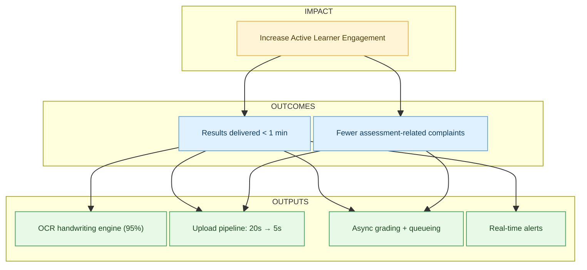

### TLDR;

The above infographic from the blog [_output vs outcome vs impact_](https://blog.crisp.se/2019/10/16/christopheachouiantz/output-vs-outcome-vs-impact) by Christophe Achouiantz does a great job of explaining the three terms in one shot. That’s all there is (literally ☺️), but if you want to explore a bit more with examples, please read on and leave a comment.

## A Mandatory Introduction

No matter how long you’re already working in product management you must have heard some “product leader” discussing:

- The great **impacts** the team will create
- How much do **outcomes** matter in the organization
- How you can’t stop being focused on delivering **output**

or something similar.

If you are (or have been) in Product, you must certainly have been part of a lot of meeting rooms, where those terms have had their fair share of talking time.

Based on the context of one’s company or industry, one creates his/her own interpretation of these terms, and they might have a different meaning based on their company’s culture or the way of working

That being said, I feel that there’s so much interchangeable views of these terms out there, that their actual meaning gets lost very often. But,

> _It would be a shame if the use of these terms is done in the regard, that someone just loves to sound smart or wants to blow a discussion out of proportion by using these jargons, when they have nothing solid to contribute._

Frustrations apart ( 😂), a much worse case of that is, the wrong understanding of those terms, which leads to misaligned and even misdirected product decisions.

Let’s try to take a look at these terms and make an effort at demystifying them.

---

## IMPACT

We will be starting with impact, because it’s the one that typically sits at the highest place in the hierarchy of these terms.

To me,

> **an impact describes a high level expression of where a company wants to be, expressed through result or metric.**

Some of the main characteristics we can see when we look at an impact is that, it typically is something that affects the whole company. Which can, in turn, be changed or impacted through many initiatives coming together.

Some instances can be company wide revenue; customer satisfaction, measured for example through customer effort score; or specific user activity metrics like weekly active users or certain other behavior which represents activity for your users.

Impact typically expresses one of three categories either it looks at something qualitative, something quantitative, or around a metric which describes the efficiency in the company.

### Example:

In our examples, let’s chose an organization and stick to it for better context. Let’s pick an EdTech org, and name it **‘Smart Tutor’** or something. (Really not good at picking names 🙈).

Apart from online content, and live classes, Smart Tutor goes beyond objective assessments, and enables AI-driven automatic scoring and grading of subjective assessments, which learners can type or even write in pen and paper mode.

In the context of Smart Tutor, the impact used can be the one, which describes their focus, on the number of active learners and/or the amount of active time learners spend on the platform. This obviously makes a lot of sense for a learning platform because it describes the health of the company and allows them to project where the company wants to be in terms of core product usage. It’s also a metric, where many departments, teams, and initiatives have to contribute, in order to actually change it.

> So far so good, but the important thing lots of people oftentimes forget is that, **the primary impact for a company, or for a team, can change overtime**. This might be based on seasonality, revenue, customer experience, or some weird external factors.

Going back to the Smart Tutor, there might be a time in history, where they might suddenly have a huge increase of customer issues and support requests due to some technical problems or as simple as a half-baked product, where they built an MVP but forgot to convert it to an FVP (Fully Viable Product).

In this case, for a specific period of time, **the company has to switch the primary impact** to reducing customer complaints. Consequently, this switch should guide which initiatives to pursue. Otherwise, the whole growth anatomy of the company can go for a toss. If they decide to ignore this and still keep focusing on push marketing and sales to increase learners, very soon the impact will start crumbling, in spite of incurring massive costs.

> Impacts should not be kept static. Even if they are carved on rocks, it’s high time to break the rock, else, in no time, the rock will become a boulder and break the org.

---

## OUTCOME

Next up is outcome. This is probably the one term product teams love to use the most these days and what everybody is talking about now, is the definition.

To me,

> **An outcome typically describes a measurable change in behavior that contributes to an impact,** meaning you should not focus on an outcome if it doesn’t contribute to a company wide metric.

The wide popularity of the term outcome is certainly influenced by Josh Seiden and his writing in this great book outcomes of outputs.

Now this change in behavior, is really something that can affect anyone, whether it’s your users your customers, or internal stakeholders. Outcomes are relevant for product teams for two main reasons;

1. Impacts might be too detached from a single product or feature release which makes it very hard for product teams to actually measure the success of their efforts. Outcomes can serve as a link between features and business metrics to serve as some kind of proxy metric so that teams can measure their progress and success more easily.

2. Starting a conversation around prioritization based on outcomes leaves way more room for creativity for the team, to explore which solutions are actually most likely to achieve.

_Outcomes should describe for whom you want to create the change behavior and to what extent the behavior has to change._

### Example

Let’s go back to Smart Tutor. For them, an outcome could be “Enabling the system to share assessment results with the learners within 1 min”. Here, we are specifically naming the type of user we’re trying to change their behavior for and to what extent. This context is important, because if we use outcomes as a frame for running ideations sessions, we can come up with proper solutions to create this particular change in behavior.

If we can be very clear and specific about whether it’s about making something faster, more convenient, or more accessible. This is pretty important to provide our team members and participants of the ideation sessions beforehand, to give them enough context, so that they can think of the best possible solutions in terms of the outcome.

Also, when we want to use outcomes for goal setting, for example by using OKRs, those outcomes should be turned into a specific number that we can measure.

---

## OUTPUTS

Now Speaking of solutions let’s also look at outputs.

> **Outputs are essentially the artifacts product team delivers through activities like scrum sprints or Kanban cycles.**

It describes a specific product or specific feature; and while many discussions revolve now in the industry on how they are prioritizing outcomes over outputs, outputs are still pretty important because it doesn’t really matter how great your selection of outcomes is, if you’re not providing a tangible solution in the form of an output for your users, the behavior of your target audience will probably not change.

### Example:

Let’s go back to ‘SmartTutor’. To drive the mentioned outcome “Enabling the system to share assessment results with the learners within 1 min”, The outputs can be to deliver an epic to read handwritings with 95% accuracy within 6 sprints or it can be to deliver a feature which reduces the time to upload handwritten pages from 20 seconds to 5 seconds.

---

If you are reading this and made it so far, please share this in the meeting rooms where you see these 3 jargon being overused to no fruitful context. **Let's make meetings less painful and more fruitful 😊.**

### Inspirations:

Book: [Outcome over Outputs by Josh Seiden](https://www.amazon.in/Outcomes-Over-Output-customer-behavior/dp/1091173265/)

Podcast: [Product Thoughts hosted by Tim Herbig](https://open.spotify.com/show/1kfyJjuL6pJEok3l2Rp3yC)