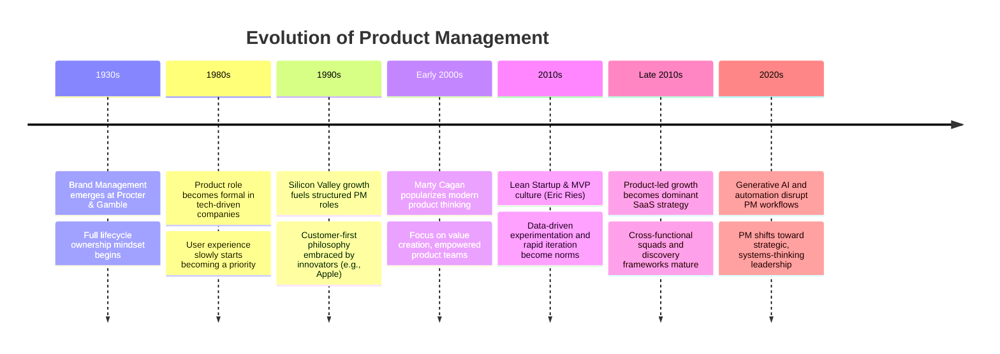

# The Evolution of Product Management: A Brief History

## A little Introduction

**Product management!** The ever-evolving, always-changing job, that is crucial to the success of any product-based company. From its humble beginnings as a behind-the-scenes role to the tech industry's poster child, product management has come a long way. In this post, we'll try to take a deep dive into the evolution of product management.

Product management might look [like a BS job](/art-of-pm/is-product-management-bs-job) but not an easy job. It's a lot like herding cats, but instead of cats, you're trying to coordinate a group of developers, designers, and stakeholders to create a product that people will love. So, let's take a look at how product management has evolved over the years.

## The Early Days

#ProductManagement  has been around for a long time, but it wasn't always a formalized role. In the early days of product development, the focus was on engineering and manufacturing, with little thought given to the user experience. As technology advanced and products became more complex, it became clear that there needed to be someone who could oversee the entire process and ensure that the product met the needs of the users.

Enter the product manager. ==**In the 1930s, Procter & Gamble introduced the concept of brand management, which included overseeing the entire life cycle of a product, from development to marketing**==. This concept was later expanded to include product management, which focused on the product itself rather than just the brand.

## The Rise of Silicon Valley

Fast forward a few decades, and product management was beginning to take on a more prominent role in the tech industry. In the 1980s and 1990s, Silicon Valley was booming, and product management became a key function in many tech companies.

One of the most famous product managers of this era is Steve Jobs, who famously said,

> _"You've got to start with the customer experience and work back toward the technology, not the other way around."_

This philosophy became the foundation of Apple's product development process, which has been emulated by countless companies since.

Another key figure in the evolution of product management is Marty Cagan, who was the VP of Products at eBay in the early 2000s. Cagan is the author of [**"Inspired: How to Create Tech Products Customers Love,"**](https://www.amazon.in/INSPIRED-Create-Tech-Products-Customers-ebook/dp/B077NRB36N/ref=sr_1_1_sspa?crid=3R9RA1V2DDBT&keywords=Inspired%3A+How+to+Create+Tech+Products+Customers+Love&qid=1682168699&sprefix=inspired+how+to+create+tech+products+customers+love%2Caps%2C229&sr=8-1-spons&sp_csd=d2lkZ2V0TmFtZT1zcF9hdGY&psc=1) which has become a bible for many product managers. In the book, Cagan emphasizes the ==**importance of focusing on the customer**== and creating products that solve real problems.

## The Lean Startup Movement

In recent years, there has been a shift in the way that products are developed. The lean startup movement, which was popularized by Eric Ries in his book ["The Lean Startup,"](https://www.amazon.in/Lean-Startup-Innovation-Successful-Businesses/dp/0670921602/ref=sr_1_3?crid=13ODQHWNGZSM5&keywords=lean+startup+by+eric+ries&qid=1682168766&sprefix=lean+startup+%2Caps%2C214&sr=8-3) emphasizes the importance of rapid experimentation and user feedback.

One of the key principles of the lean startup approach is the idea of the ==**minimum viable product (MVP)**==. Instead of spending months or even years developing a product, the lean startup approach involves creating a stripped-down version of the product and getting it into the hands of users as quickly as possible. This allows the product team to gather feedback and make improvements based on real-world usage.

The lean startup approach has been embraced by many successful companies, including Dropbox, Airbnb, and Uber.

## The Future of Product Management (As on before Nov 2022)

So, what does the future hold for product management? As technology continues to advance and products become even more complex, the need for skilled product managers will only increase.

One trend that we're likely to see in the coming years is the blurring of the lines between product management and other roles, such as design and engineering. As Jeff Gothelf puts it,

> _"Product management is becoming synonymous with good design and good business."_

In order to create successful products, it's essential to have a cross-functional team that includes product managers, designers, engineers, and other stakeholders. This means that product managers will need to have a broad range of skills and be able to work collaboratively with others.

Another trend that we're likely to see is the ==**increased use of data and analytics in product development**==. Product managers will need to be skilled at gathering and analyzing data, and using that data to make informed decisions about product development.

As David Cancel, CEO of Drift, puts it,

> _"The product manager of the future will be more data-driven, more customer-focused, and more design-aware."_

In order to be successful in this role, product managers will need to be adaptable and willing to learn new skills as technology and the market continue to evolve.

  

## In comes ChatGPT and other generative AI

The impact of ChatGPT and other generative AI tools on the role of product management is not very clear-cut. Some experts believe that AI tools will disrupt product management in a big way, while others argue that it will only enhance the role of product managers.

As Mark Faggiano, CEO of TaxJar, puts it,

> _"The rise of AI and machine learning will likely automate many of the tactical responsibilities of product management, but it will also open up new opportunities for strategic leadership."_

In other words, AI tools can handle the mundane tasks of product management, such as data analysis and reporting, allowing product managers to focus on higher-level strategic thinking and decision-making.

On the other hand, some experts believe that AI tools will eventually replace the need for human product managers altogether.

> _"AI can predict what the customer wants and needs, what features will have the most impact, and even what the price point should be."_

==If AI tools can do all of that, what's the point of having a human product manager?==

However, many product managers and industry leaders argue that AI tools cannot replace the human touch when it comes to product development. As Teresa Torres, product discovery coach and author, puts it,

> _"Product management is still a human-centric role, focused on understanding people and solving their problems."_

While AI tools can provide valuable insights, they cannot replace the empathy and creativity that human product managers bring to the table, _at least not yet._

So, while the impact of ChatGPT and other generative AI tools on the role of product management is still up for debate, one thing is clear: product managers will need to continue to evolve and adapt to stay relevant in a rapidly changing technological landscape. As Eric Feng, former CTO of Hulu, puts it,

> _"Product management will always be necessary, but the definition of the role will change over time."_

And as we have seen throughout the brief history, this is, I guess, the fastest evolving role in the entire business world, The key for product managers will be to stay ahead of the curve and ==**embrace new technologies as they emerge.**==

---

Product management is an essential role and is unlikely to be eliminated any time soon. While the role may evolve with the emergence of new technologies, the need for human product managers who can bring empathy, creativity, and strategic thinking to the table will continue to be in demand. As the future of product management continues to take shape, one thing is for sure: this is an exciting and challenging role that will continue to be in high demand for years to come.

> _"The role of the product manager is to discover a product that is valuable, usable, and feasible."_

And with the right skills and mindset, product managers can keep on doing just that.