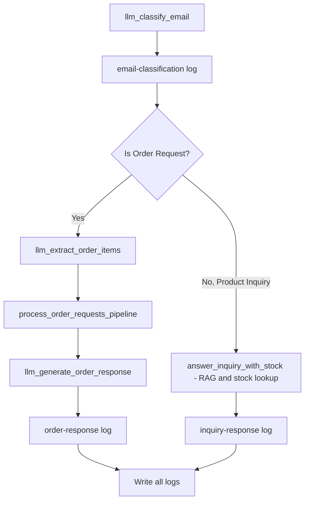

# AI-Powered Email Processing System for a Fashion Retailer

### Turning chaotic inboxes into structured, automated order & inquiry workflows

Retail operations look deceptively simple from the outside: customers email, staff respond, orders get booked, stock gets updated. Under the hood, it’s usually an unstructured mess—especially for small or mid-size fashion brands that haven’t fully automated their digital operations. The result is slow responses, lost orders, inconsistent inventory updates, and frustrated customers.

This project is a practical proof-of-concept that shows how LLMs can be deployed as real workers in this workflow. Not abstract magic. Actual operational logic.

#### The goal:  
Automatically read incoming emails, understand whether they are **order requests** or **product inquiries**, extract structured data, check stock, update inventory, and generate responses—end to end.

Everything runs through a modular chain of LLM-based “micro-agents,” each responsible for a small, verifiable task. This keeps the system interpretable instead of becoming a mysterious black box.

[Github Repo:](https://github.com/dibyendutapadar/ai-fashion-store-email-automation)

---

## Business Context: Why This Problem Exists

A fashion retailer receives two types of recurring emails:

1. **“Do you have this in size M?”**  
    — product inquiries
    
2. **“I want to order 2 beige linen shirts.”**  
    — order requests
    

These land in a common inbox. Humans spend hours manually:

- reading each email
    
- determining intent
    
- checking product catalog and stock
    
- preparing responses
    
- adjusting inventory
    
- logging orders manually in sheets / db
    

The friction multiplies with scale.  
The mistakes multiply even faster.

An LLM-based system solves exactly these bottlenecks:

- no missed orders
    
- real-time stock updates
    
- consistent responses
    
- structured logs for auditing
    
- scalability without hiring more staff
    

The system is not meant to be a chatbot. It is meant to be an intelligent back-office worker—fast, predictable, and fully auditable.

---

## Technical Overview: How the System Works

The design intentionally avoids monolithic “one giant prompt” architectures. Instead, each function is a narrow expert—an independent agent.

Processing happens **sequentially**, not in batches, to maintain inventory correctness. When two emails request the same product, sequential order ensures one stock update happens before the next evaluation.

Everything flows through a deterministic pipeline:

This structure makes the system easy to reason about, easy to debug, and easy to extend.

## Potential Future Extensions

-  **Multi-store inventory sync**
	- If stock is distributed across warehouses.
- **Price negotiation automation**
	- Common in boutique fashion retail.
- **CRM integration**
	- Tag customers by intent, lifecycle, and purchase history.
- **Predictive insights**
	- Incoming email patterns → demand forecasting  
	- (email-driven signals are underutilized gold)
- **Full order booking**
	- Push confirmed orders directly into ERP or Shopify.

The pipeline already supports extension because each agent is isolated.