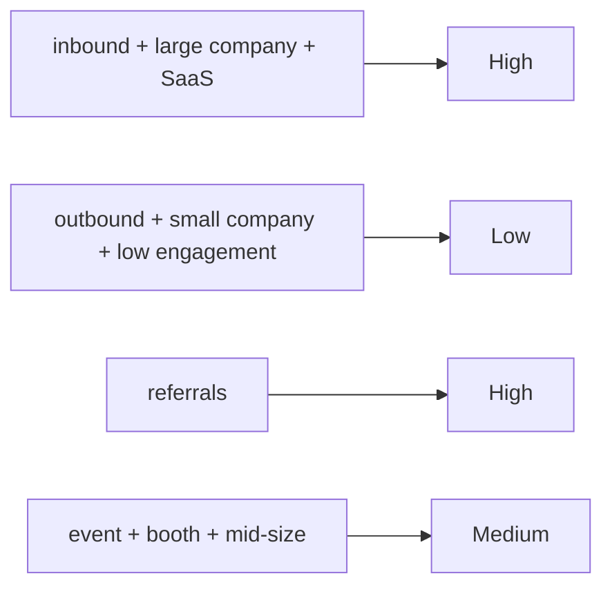

### Part 1 of "AI ain't Magic, It's Math"

Before AI became what it is today, machines behaved like bureaucrats: they only did what you explicitly told them to do.
Software was ==Rules Based==.
Meaning: you wrote conditions, and the machine reacted to those conditions.

First you create the rules mentally
> If  A happens then  X, If B and C happends then do Y, If A and D and E Happens then Do Z
Then hard code it

```python
if A:
    if D and E:
        execute(z)
    else:
        execute(x)
elif B and C:
    execute(y)
	
```

It works. It's very deterministic.
But only until the real world becomes messy, and with the scale of data we deal with today, in certain cases, this approach couldn't fly. 

---

## Lets take the example of lead scoring in sales. 

A company have a dataset of 

| Source   | Company_Size | Industry   | Budget | ... | Final_Score |
| -------- | ------------ | ---------- | ------ | ---------------  | ----------- |
| inbound  | 1200         | SaaS       | 20000  | ...           | High        |
| inbound  | 800          | Retail     | 10000  | ...             | High        |
| outbound | 6000         | Finance    | 15000  | ...              | Medium      |
| inbound  | 200          | Travel     | 3000   | ...             | Low         |
| referral | 500          | SaaS       | 50000  | ...            | High        |
| event    | 350          | Retail     | 8000   | ...           | Medium      |
| outbound | 1000         | Healthcare | 25000  | ...            | Medium      |
| inbound  | 1500         | Finance    | 60000  | ...             | High        |
| event    | 200          | Education  | 2000   | ...              | Low         |
| outbound | 400          | SaaS       | 5000   | ...              | Low         |


At first, companies write a few rules based on observations:

- inbound + large company + SaaS → High
    
- outbound + small company + low engagement → Low
    
- referrals → High
    
- event + booth + mid-size → Medium
    

These patterns come from looking at past leads and noticing what usually works.

Something like this:



The problem?  
As business grows, the number of conditions explodes.  
You add exceptions, sub-rules, and patches.  
Eventually, it becomes a jungle of _“just add one more condition”_ hacks.

**Maintaining this is not a job, it's a punishment.**

This is the limit of the rules-based world.

---
## The Shift: from writing rules to learning from examples

Instead of telling the machine:

> “If X and Y and Z happen, give High score…”

we give it **all past examples**:

```yaml

Source | Company_Size | Industry | Budget | ... | Final_Score
inbound | 1200 | SaaS | 20000 | ... | High
outbound | 6000 | Finance | 15000 | ... | Medium
referral | 500 | SaaS | 50000 | ... | High
event | 200 | Education | 2000 | ... | Low
...
```

Everything except **Final_Score** is the **input (`features`)**.  
**Final_Score** is the **output (`target`)**.

The machine’s job:  
Look at thousands of “input → output” pairs and learn the patterns humans used to manually write.

That’s it.  
No magic.  
Just pattern learning at scale.

Once the machine has learned from the old data, give it new unseen leads:

```yaml
Source: inbound
Company_Size: 1800
Industry: SaaS
Budget: 45000
Past_Engagement: high
...

```

And it will say:

→ **High**

No one wrote this rule.  
It emerged from patterns in the data.

Humans can’t do this reliably when the dataset crosses a few thousand rows.  
Machines thrive on it.  
More data → more nuance → better patterns.

This is the essence of Machine Learning:

> Where on one side learning from huge data set is cognitively impossible for a human brain to create the rules, that's a boon for AI - more the data, more the nuances and edges captured and learnt.

That shift from **if-else rules** to **learning from examples** is the intuitive jump from traditional software to modern ML.


The idea looks solid, but now the task was to create algorithms on how machine could learn from data
More about that in the next part here

[What all can ML do](/tech-for-pm/types-of-problems-where-ml-can-be-applied)

---