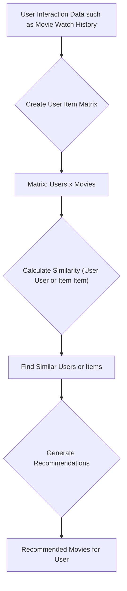
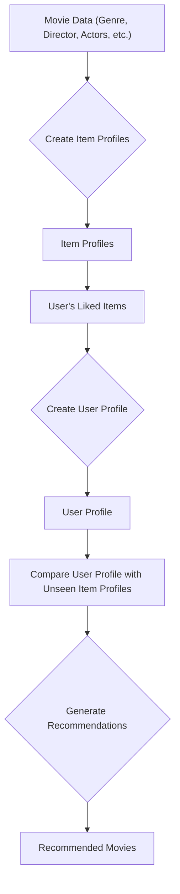

Ever wonder how your email app just  _knows_  what spam is? Or how Netflix uncannily suggests the exact B-movie you were secretly in the mood for? The answer is Machine Learning (ML).

Before ML, software was a bit of a bureaucrat. You had to write explicit, rigid  `if-this-then-that`  rules for every single possibility. This works fine until the real world, in all its messy glory, shows up. ML flips the script. Instead of feeding a machine rules, you feed it  _examples_. The machine's job is to look at thousands or millions of examples and figure out the patterns on its own.

In this post, we'll skip the scary math and build your intuition for the four most common jobs we give to traditional ML:

-   **Classification:**  Is this A or B?
-   **Regression:**  How much of this will there be?
-   **Clustering:**  What are the natural groups in this data?
-   **Recommendations:**  Since you liked that, you'll probably like this.

Let's dive in.

### Classification: The Art of Sorting Your Data

Think of a classification model as a sorting hat for your data. Its one job is to look at a new piece of data and assign it to a predefined category or "class." This is a type of  **supervised learning**, which is a fancy way of saying we have to give the machine an answer key to learn from first.

**Example: Will This User Pay Up?**

A classic business problem: you have a ton of users on a free plan. Which ones are likely to convert to a paid subscription? This is a perfect sorting problem. The only two buckets are "Yes, they'll convert" and "No, they won't."

To teach the machine, we'd give it a pile of historical data that looks something like this:

| User ID | Time Spent (hours) | Features Used (count) | Support Tickets (count) | Last Login (days ago) | **Converted (Target)** |
| ------- | ------------------ | --------------------- | ----------------------- | --------------------- | ---------------------- |
| 101     | 5.2                | 3                     | 1                       | 5                     | Yes                    |
| 102     | 1.1                | 1                     | 0                       | 20                    | No                     |
| 103     | 8.5                | 5                     | 2                       | 2                     | Yes                    |
| 104     | 2.0                | 2                     | 0                       | 15                    | No                     |
| 105     | 6.1                | 4                     | 1                       | 3                     | Yes                    |

**How does the algorithm work?**

Any algorithm is a three-step dance:

1.  **Prep the Data:**  You gather all your historical user data, including that all-important  `Converted`  column (the "answer key"). You clean it up and select the features—the input signals—that you think might predict the outcome. This is more art than science.
2.  **Train the Model:**  You feed this labeled data to a classification algorithm (its name doesn't matter for now). The algorithm's goal is to find the patterns. It might learn that users who spend more time on the app, use more features, and interact less with support are more likely to convert. It's essentially drawing a line in the sand that best separates the "Yes" crowd from the "No" crowd.
3.  **Make Predictions:**  Once the model is trained, it's ready for the real world. You show it a  _new_  free user who has spent 4.5 hours, used 3 features, and last logged in 7 days ago. The model looks at this new data, compares it to the patterns it learned, and spits out a prediction: "Yes" or "No," often with a confidence score.

### Regression: Predicting a Number

Okay, sorting is cool. But what if you don't need to put something in a bucket? What if you need to predict a specific, continuous  _number_? That's where regression comes in. It's also supervised learning, but instead of predicting a label (`Yes`/`No`), it predicts a value (like  `$55,000`).

**Example: How Much Will We Spend?**

Imagine you're trying to forecast next year's operating expenses. You know that hiring more people costs more money, but by how much exactly? You want a model that takes your hiring plan and predicts the total cost.

Your training data might look like this:

| Month | Department  | Level   | Planned Headcount | Previous Quarter Expenses | **Operating Expenses (Target)** |
| ----- | ----------- | ------- | ----------------- | ------------------------- | ------------------------------- |
| Jan   | Engineering | Senior  | 15                | 50,000                    | 55,000                          |
| Jan   | Sales       | Junior  | 25                | 30,000                    | 33,000                          |
| Feb   | Engineering | Junior  | 10                | 45,000                    | 48,000                          |
| Feb   | Marketing   | Manager | 5                 | 20,000                    | 22,000                          |
| Mar   | Sales       | Senior  | 20                | 35,000                    | 38,000                          |

**So, what features do we need?**

-   **Headcount Info:**  The number of hires, by department and seniority. Senior engineers cost more than junior sales, for example.
-   **Departmental Nuance:**  Engineering costs might behave differently from Marketing costs.
-   **Historical Expenses:**  Last quarter's expenses are often a solid baseline.
-   **Other Cost Drivers:**  Think office space, IT licenses, whatever else moves the needle.

**How does it work?**

Pretty similar to classification, just with a different goal:

1.  **Prep the Data:**  Collect historical data connecting your inputs (headcount, department, level, previous expenses) to your output (actual operating expenses). Clean and format it so the algorithm can chew on it.
2.  **Train the Model:**  Feed this data to a regression algorithm. Instead of finding a line to  _separate_  data points, it tries to find a mathematical equation that  _best fits_  the data points. It's looking for a predictable relationship. It might learn that, on average, hiring five new senior engineers correlates with an approximate $10,000 increase in operating expenses.
3.  **Make Predictions:**  Now, you can give the model your future hiring plan: "We're planning to hire 20 new engineers (split junior/senior) and 8 new junior salespersons next quarter." The model uses the formula it learned to crunch the numbers and outputs a single dollar amount—your predicted operating expenses.

### Clustering: Finding the Tribes in Your Data

So far, we've been giving the machine an answer key (labeled data). But what if you don't have one? What if you just have a mountain of data and a hunch that there are natural groups hidden inside? This is  **unsupervised learning**, and its most common tool is clustering.

The goal is simple: group similar things together. The algorithm figures out what "similar" means on its own.

**Example: Who Are Your Users,  _Really_?**

A software company wants to understand its user base better. Are they all the same, or are there different "tribes" of users who behave differently? This helps them tailor features, marketing, and support.

You start with raw, unlabeled behavioral data, focusing on metrics like:

| User ID | Logins Per Week | Features Used Per Session | Session Duration (min) | Actions Per Session | **Cluster (Assigned)** |
| ------- | --------------- | ------------------------- | ---------------------- | ------------------- | ---------------------- |
| U001    | 7               | 8                         | 45                     | 25                  | Power User             |
| U002    | 1               | 2                         | 10                     | 5                   | Inactive User          |
| U003    | 4               | 5                         | 20                     | 15                  | Intermittent User      |
| U004    | 6               | 7                         | 40                     | 22                  | Power User             |
| U005    | 2               | 3                         | 15                     | 8                   | Degrading User         |
| U006    | 0               | 1                         | 5                      | 2                   | Inactive User          |
| U007    | 3               | 4                         | 18                     | 12                  | Intermittent User      |

**What features do we need?**

-   **Usage Frequency:**  How often do they log in?
-   **Feature Adoption:**  How many different parts of the app do they touch?
-   **Session Metrics:**  How long do they stay? How much do they  _do_  in a session?
-   **Engagement Depth:**  Are they just logging in, or are they really digging into core functions?

**How does a Clustering Algorithm Work?**

1.  **Prep the Data:**  Gather all your user behavior data. Remember, no predefined 'Cluster' column here—the algorithm makes those up. We just numericalize our chosen features.
2.  **Run the Algorithm:**  You unleash a clustering algorithm (like the popular K-Means) on the data. Imagine it works like this:
    -   The algorithm starts by randomly placing 'k' cluster centers (centroids) in your data space. Think of them as initial "leaders" for groups.
    -   It then iteratively assigns each data point (a user) to the nearest centroid.
    -   After assignment, it recalculates each centroid's position based on the average of all points assigned to it. The "leader" moves to the center of its group.
    -   This process repeats: users get reassigned to their closest new leader, and leaders move again. This continues until the centroids stabilize, meaning users no longer shift between clusters.
3.  **Interpret the Clusters:**  The machine doesn't name the groups; it just creates them. It's up to a human to look at the users in each cluster and give them a meaningful label. You might find:
    -   **Power Users:**  High login frequency, extensive feature use, long sessions.
    -   **Intermittent Users:**  Moderate usage, sporadic engagement.
    -   **Degrading Users:**  Declining usage patterns, fewer features used over time.
    -   **Inactive Users:**  Very low or no recent activity.

### Recommendation Systems: "You Might Also Like..."

You already know this one. It's the engine behind Amazon, Netflix, and Spotify. Recommendation systems predict what a user might like based on their past behavior and the behavior of similar users. Let's look at two traditional approaches for a streaming service recommending movies.

**Approach 1: Collaborative Filtering (The Wisdom of the Crowds)**

The core idea: "People who liked what you liked also liked..." It doesn't need to know anything about the movies themselves, just who watched what. The data is typically structured as a user-item interaction matrix.

| User ID | Movie A (e.g., "Inception") | Movie B (e.g., "The Dark Knight") | Movie C (e.g., "Shrek") | Movie D (e.g., "Parasite") |
| ------- | --------------------------- | --------------------------------- | ----------------------- | -------------------------- |
| Alice   | 1                           | 1                                 | 0                       | 1                          |
| Bob     | 1                           | 1                                 | 0                       | 0                          |
| Charlie | 0                           | 0                                 | 1                       | 0                          |
| David   | 1                           | 0                                 | 0                       | 1                          |
| Eve     | 0                           | 0                                 | 1                       | 0                          |

_(A '1' indicates the user has watched or liked the movie; '0' indicates they have not.)_

**How a Collaborative Filtering Algorithm Works:**

1.  **User-Item Matrix Creation:**  First, we build a giant grid where rows are users and columns are movies. Each cell notes if a user watched/liked a movie.
2.  **Finding Similarities:**  The algorithm then hunts for similarities, either between users or between movies:
    -   **User-Based Similarity:**  It finds users whose viewing habits closely match the target user. If Bob and Alice watched the same collection of action movies, they're "similar."
    -   **Item-Based Similarity:**  It focuses on finding movies that are frequently enjoyed by the  _same group_  of people. If users who liked "Inception" also commonly liked "The Dark Knight," these two movies are considered similar.
3.  **Generating Recommendations:**
    -   **User-Based Approach:**  If Bob watched "Inception" and "The Dark Knight," and Alice watched those  _plus_  "Parasite," the system might recommend "Parasite" to Bob because Alice is a "taste-twin."
    -   **Item-Based Approach:**  If a user watches "The Dark Knight," the system looks for other movies commonly watched by people who liked "The Dark Knight." If "Inception" comes up often, it's a good bet for the current user.
4.  **Training:**  Algorithms like K-Nearest Neighbors (KNN) or matrix factorization (like SVD) are used to crunch these similarities efficiently.

**Visualizing the Collaborative Filtering Flow:**

**Approach 2: Content-Based Filtering (If You Like Apples...)**

The core idea: "You liked this thing, so you'll probably like other things with similar attributes." This method cares deeply about the  _content_  of the items themselves.

| Movie ID | Title           | Genre             | Director   | Actors (Top 2)                      |
| -------- | --------------- | ----------------- | ---------- | ----------------------------------- |
| M01      | Inception       | Sci-Fi, Thriller  | C. Nolan   | L. DiCaprio, E. Page                |
| M02      | The Dark Knight | Action, Crime     | C. Nolan   | C. Bale, H. Ledger                  |
| M03      | Shrek           | Animation, Comedy | A. Adamson | M. Myers, E. Murphy                 |
| M04      | Parasite        | Drama, Thriller   | B. Joon-ho | S. Kang, T. Choi                    |
| M05      | Interstellar    | Sci-Fi, Drama     | C. Nolan   | M. McConaughey, A. Hathaway |

**How a Content-Based Filtering Algorithm Works:**

1.  **Item Profiling:**  Each movie gets a detailed "profile" based on its characteristics—genre, director, actors, even keywords.
2.  **User Profiling:**  The system then builds a profile for  _you_, based on the movies you've liked. If you loved "Inception" and "Interstellar," your profile might scream "Sci-Fi," "Christopher Nolan," and "Thriller/Drama."
3.  **Recommendation Generation:**  The algorithm compares your profile to all the unseen movie profiles. It then recommends the movies whose attributes most closely align with your established preferences. For instance, a Sci-Fi fan who loves Christopher Nolan would definitely get "Interstellar" suggested.

**Visualizing the Content-Based Filtering Flow:**

